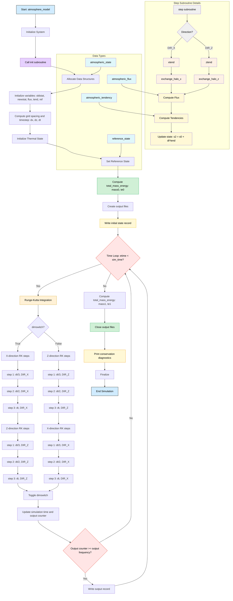

# 🌬️ Atmospheric Transport Model - SpiceGirlsSoftware

We present the SpiceGirlsSoftware, a 2D atmospheric transport simulation provided to us in serial for the **MHPC P1.9 Module** written in Fortran. We add optional acceleration using OpenMP, OpenACC, and MPI parallelization. We present:

- Cuda-aware MPI support
- Optional compile options for OpenMP
- Optional OpenACC GPU offloading with NVIDIA GPUs using Device to Device memory tranfers
- Configurable Grid Size + Simulation Time
- Parallel NetCDF writes

The project files are organised as follow:

```
parallel/
├── Makefile          (Sample for you to follow!)
├── model.f90
├── module_parameters.f90
├── module_types.F90
├── module_physics.f90
├── module_output.F90
├── module_nvtx.F90   (timing utilities)
└── parallel_timer*   (timing utilities)
```
<br>
<br>

# 🔧 Requirements

To build the model you will need need:

- A Fortran compiler (nvfortran or gfortran for CPU-only builds)
- An MPI compiler wrapper for Fortran and C++ (mpif90, mpicxx)
- The NetCDF-Fortran library
- A CUDA toolkit (only if using OpenACC/timing with NVTX)


Fortunately, Leonardo has suitabkle modules to provide all of these requirements. The module load combination used in provided Makefile (and the one we would recommend) is as follows:


```
module purge

module load cuda/12.6
module load nvhpc/24.5
module load hpcx-mpi/2.19
module load gcc/12.2.0
module load netcdf-fortran/4.6.1--hpcx-mpi--2.19--nvhpc--24.5
```

<br>
<br>

# 🏗️ Compilation

The provided Makefile supports several build options:


| Variable        | Meaning                         |
| --------------- | ------------------------------- |
| `DEBUG=1`       | Add debugging flags (default)   |
| `DEBUG=0`       | Build optimized release version |
| `USE_OPENACC=1` | Enable GPU acceleration         |
| `USE_OPENMP=1`  | Enable OpenMP threading         |


#### Building a CPU version with no OMP multithreading:
```
make clean
make DEBUG=0 USE_OPENACC=0 USE_OPENMP=0
```

#### Building a CPU version with OMP multithreading:
```
make clean
make DEBUG=0 USE_OPENACC=0 USE_OPENMP=1
```

#### Build GPU (OpenACC + MPI):
```
make clean
make DEBUG=0 USE_OPENACC=1 USE_OPENMP=0
```

#### Build GPU version with OMP init + GPU Offloading: (OpenACC + MPI + OACC):
```
make clean
make DEBUG=0 USE_OPENACC=1 USE_OPENMP=1
```

#### Building with debugging flags (for developers!)

Simply build your desired combination with `make DEBUG=0 USE_OPENACC=<1 or 0> USE_OPENMP=<1 or 0>` and the sutomatic switching in the makefile will apply appropriate flags to the relevant compiler.

<br>
<br>


# ▶️ Running the Model

Building will provide with the `model` executable, which takes two arguments

```
./model nx_size sim_time
```

For example:

```
./model 2000 1000.0
```

The provided sbatch files are user-agnostic and are ready to work on Leonardo. If you use using the programme outisde Leonardo, the sbatch files will provide a blueprint on which to base your batch submission files.

<br>
<br>

# 📊 Output Files

`output.nc`: NetCDF file containing density field $\rho$(x, z, t), momentum fields $u$(x, z, t) and $\omega$(x, z, t). The output also has grid configuration metadata.

### For developers
`statistics_*.txt` and `.nsys-rep` files provide diagnostic data.

<br>
<br>

# ✏️ Comparing the Serial vs. Parallel verions

#### Serial



#### Parallel

```mermaid

  flowchart TD
    Start([Program Start]) --> InitMPI[MPI_Init: Initialize MPI]
    InitMPI --> GetRank[Get MPI rank & size]
    GetRank --> CreateCart[MPI_Cart_create: Create 1D Cartesian topology]
    CreateCart --> GetNeighbors[MPI_Cart_shift: Get left/right neighbor ranks]
    
    GetNeighbors --> CheckGPU{OpenACC enabled?}
    CheckGPU -->|Yes| DetectGPU[acc_get_num_devices: Detect NVIDIA GPUs]
    DetectGPU --> AssignGPU[acc_set_device_num: Assign GPU to rank]
    CheckGPU -->|No| DomainDecomp
    
    AssignGPU --> DomainDecomp[Domain Decomposition:<br/>Divide nx by MPI ranks]
    DomainDecomp --> AllocMem[Allocate memory for:<br/>oldstat, newstat, flux, tend, ref]
    
    AllocMem --> AccData{OpenACC enabled?}
    AccData -->|Yes| CopyToGPU[!$acc enter data:<br/>Copy state arrays to GPU]
    AccData -->|No| AllocBuffers
    CopyToGPU --> AllocBuffers
    
    AllocBuffers --> AllocBuf{OpenACC enabled?}
    AllocBuf -->|Yes| AllocGPUBuf[Allocate GPU buffers:<br/>send_left_d, recv_left_d, etc.]
    AllocBuf -->|No| AllocCPUBuf[Allocate CPU buffers:<br/>send_left, recv_left, etc.]
    
    AllocGPUBuf --> MainLoop
    AllocCPUBuf --> MainLoop
    
    MainLoop[Time Integration Loop] --> RK[Runge-Kutta Scheme:<br/>6 substeps alternating X/Z]
    
    RK --> StepX[Step in X direction]
    StepX --> XTend[xtend: Compute X fluxes]
    
    XTend --> HaloX[exchange_halo_x]
    HaloX --> PackX{OpenACC enabled?}
    
    PackX -->|Yes| PackGPU[!$acc parallel loop:<br/>Pack halo data on GPU]
    PackX -->|No| PackCPU[pack_strip:<br/>Pack halo data on CPU]
    
    PackGPU --> MPISendRecvX
    PackCPU --> MPISendRecvX
    
    MPISendRecvX[MPI_Isend/MPI_Irecv:<br/>Non-blocking send/recv to neighbors]
    MPISendRecvX --> MPIWaitX[MPI_Waitall:<br/>Wait for communication]
    
    MPIWaitX --> UnpackX{OpenACC enabled?}
    UnpackX -->|Yes| UnpackGPU[!$acc parallel loop:<br/>Unpack received data on GPU]
    UnpackX -->|No| UnpackCPU[unpack_strip:<br/>Unpack on CPU]
    
    UnpackGPU --> FluxX
    UnpackCPU --> FluxX
    
    FluxX[Compute X fluxes with:<br/>!$acc parallel loop OR !$omp parallel do]
    FluxX --> UpdateX[Update tendency in X]
    
    UpdateX --> StepZ[Step in Z direction]
    StepZ --> ZTend[ztend: Compute Z fluxes]
    
    ZTend --> HaloZ[exchange_halo_z:<br/>Apply boundary conditions]
    HaloZ --> FluxZ{OpenACC enabled?}
    
    FluxZ -->|Yes| FluxZGPU[!$acc parallel loop:<br/>Compute Z fluxes on GPU]
    FluxZ -->|No| FluxZCPU[!$omp parallel do:<br/>Compute Z fluxes on CPU]
    
    FluxZGPU --> UpdateZ
    FluxZCPU --> UpdateZ
    
    UpdateZ[Update state:<br/>s2 = s0 + dt * tendency]
    UpdateZ --> CheckTime{etime < sim_time?}
    
    CheckTime -->|Yes| CheckOutput{Output time?}
    CheckOutput -->|Yes| WriteOutput[write_record:<br/>Gather and write to NetCDF]
    WriteOutput --> CheckReduce
    CheckOutput -->|No| CheckReduce
    
    CheckReduce{Diagnostic time?}
    CheckReduce -->|Yes| ComputeMass[Compute mass/energy locally]
    ComputeMass --> ReduceOp[MPI_Allreduce:<br/>Sum across all ranks]
    ReduceOp --> RK
    CheckReduce -->|No| RK
    
    CheckTime -->|No| Cleanup
    
    Cleanup[Cleanup and Finalization]
    Cleanup --> AccCleanup{OpenACC enabled?}
    AccCleanup -->|Yes| ExitData[!$acc exit data:<br/>Delete GPU data]
    AccCleanup -->|No| DeallocCPU
    
    ExitData --> DeallocGPU[Deallocate GPU buffers]
    DeallocGPU --> CloseMPI
    DeallocCPU[Deallocate CPU buffers] --> CloseMPI
    
    CloseMPI[MPI_Finalize] --> End([Program End])

    %% Color definitions
    style InitMPI fill:#e1f5ff,color:#000
    style CreateCart fill:#e1f5ff,color:#000
    style MPISendRecvX fill:#e1f5ff,color:#000
    style MPIWaitX fill:#e1f5ff,color:#000
    style ReduceOp fill:#e1f5ff,color:#000
    style CloseMPI fill:#e1f5ff,color:#000

    style DetectGPU fill:#ffe1e1,color:#000
    style AssignGPU fill:#ffe1e1,color:#000
    style CopyToGPU fill:#ffe1e1,color:#000
    style PackGPU fill:#ffe1e1,color:#000
    style UnpackGPU fill:#ffe1e1,color:#000
    style FluxZGPU fill:#ffe1e1,color:#000
    style ExitData fill:#ffe1e1,color:#000
```


